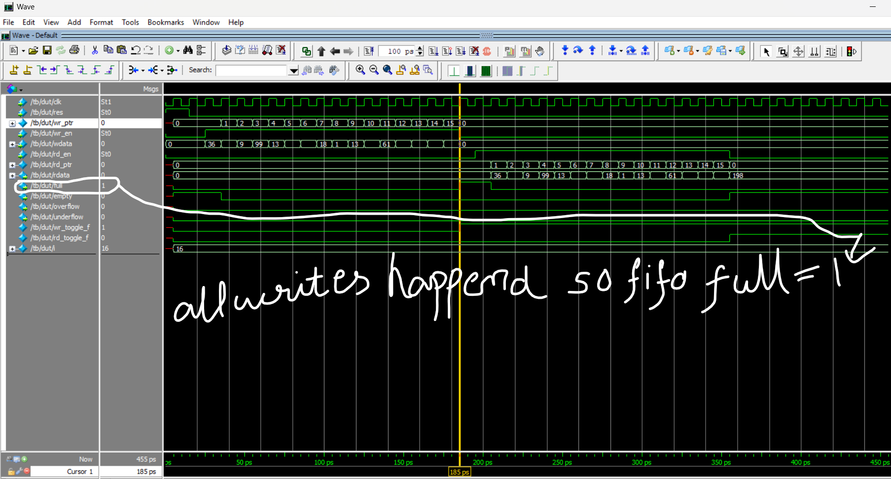

# FPGA FIFO: Synchronous & Asynchronous Designs

This repository demonstrates two fundamental FIFO (First-In-First-Out) memory architectures for FPGA systems.

---

## Why FIFO? Importance in FPGA Design

A **FIFO (First-In-First-Out) buffer** is a memory structure that outputs data in the same order it was received. FIFOs are essential in digital systems for:

- **Data buffering:** Smooths out differences in data rates between producer and consumer modules.
- **Clock domain crossing:** Safely transfers data between modules running on different clocks.
- **Flow control:** Prevents data loss or corruption when one part of a system is faster than another.

### Why use a FIFO in Synchronous (Same Clock) Systems?

Even when both producer and consumer operate on the **same clock**, a FIFO is valuable because:
- The producer and consumer may not always be ready at the same time. For example, the producer might generate data in bursts, or the consumer might be temporarily busy processing previous data.
- The FIFO acts as a buffer, allowing the producer to continue sending data even if the consumer is momentarily unavailable, and vice versa.
- This decouples the timing between modules, increases throughput, and prevents data loss or stalling when either side is busy.

**In summary:**  
A synchronous FIFO enables smooth, efficient data transfer between modules sharing a clock, especially when their processing rates or availability are not perfectly matched.

## FIFO Types in This Repository

- **Synchronous FIFO:**  
  Operates with a single clock, ideal for high-speed buffering when write and read share the same clock.

- **Asynchronous FIFO:**  
  Supports independent write and read clocks, enabling safe data transfer across different clock domains.

---

## Key Differences

| Feature                | Synchronous FIFO                        | Asynchronous FIFO                          |
|------------------------|-----------------------------------------|--------------------------------------------|
| **Clock Domains**      | Single                                  | Separate (write & read)                    |
| **Design Complexity**  | Simpler                                 | More complex (handles clock crossing)      |
| **Use Case**           | Same-clock data buffering               | Cross-clock data transfer                  |
| **Typical Application**| Internal module pipelines               | Interfacing peripherals, clock domain crossing |

---

## Test Cases & Waveforms

### Synchronous FIFO

- **Normal Operation:**  
  - *Consecutive writes and reads (with data loss):*  
    Demonstrates what happens when data is written and read in sequence, but the FIFO overflows and some data is lost.  
    
  - *Consecutive writes and reads (without data loss):*  
    Shows correct FIFO operation when writes and reads are balanced, ensuring all data is preserved.  
    
  - *Consecutive operations:*  
    Illustrates the FIFO handling a series of write and read operations.  
    

- **Full Condition:**  
  The FIFO signals `full` when it cannot accept more data. This prevents overwriting unread data and is crucial for data integrity.  
  

- **Empty Condition:**  
  The FIFO signals `empty` when all stored data has been read. This prevents reading invalid or old data.  
  

- **Overflow:**  
  Occurs when a write is attempted while the FIFO is full. The overflow flag helps detect and handle this error condition.  
  

- **Underflow:**  
  Occurs when a read is attempted while the FIFO is empty. The underflow flag helps detect and handle this error condition.  
  

---

### Asynchronous FIFO

- **Normal Operation:**  
  - *Consecutive operations (video):*  
    Shows the FIFO in action with asynchronous clocks.  
    [Async Consecutive Operations (mp4)](asyn_fifo/async_consecutive.mp4)

- **Full Condition:**  
  The FIFO asserts `full` when the write pointer catches up to the read pointer in the circular buffer, preventing further writes until space is available.  
  

- **Empty Condition:**  
  The FIFO asserts `empty` when the read pointer catches up to the write pointer, indicating no data is available to read.  
  

- **Overflow:**  
  Indicates an attempt to write when the FIFO is already full, which could result in data loss if not handled.  
  

- **Underflow:**  
  Indicates an attempt to read when the FIFO is empty, which could result in invalid data if not handled.  
  

---
 Shaik Mahammad Hussain

Explore the code, testbenches, and waveform images to see these conditions in action and understand how robust FIFO design is critical for reliable FPGA systems!
